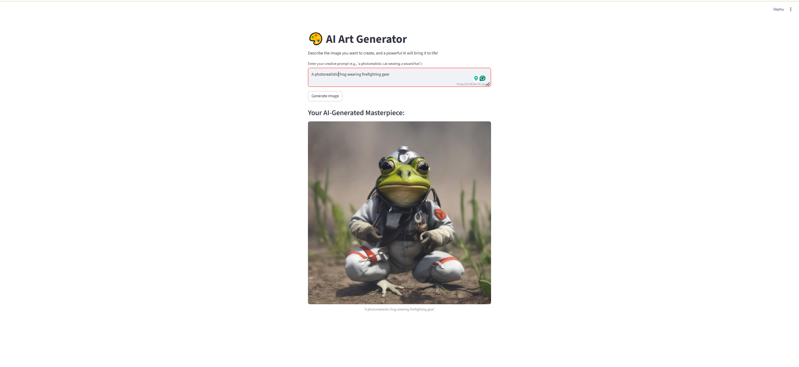

# AI Art Generator (Streamlit + Hugging Face API)

## 🚀 Live App

*[[Your Live App Link Will Go Here After Deployment](https://sarthakaiart.streamlit.app/)]*

---

## 🎨 Demo

This project is a fully interactive web application that generates original images from text descriptions. It uses the powerful Stable Diffusion XL model, accessed via the Hugging Face Inference API, and is built with a clean, modern user interface in Streamlit.



---

## 🛠️ Technologies Used

* **Python:** The core programming language.
* **Streamlit:** For building the interactive web user interface.
* **Hugging Face Inference API:** For running the state-of-the-art Stable Diffusion XL model.
* **Requests & Pillow:** For handling the API communication and image processing.

---

## ▶️ How to Run Locally

1.  **Clone the repository & navigate to the folder.**

2.  **Create and activate a virtual environment:**
    ```bash
    py -m venv venv
    .\venv\Scripts\activate
    ```

3.  **Install dependencies:**
    ```bash
    pip install -r requirements.txt
    ```

4.  **Set up your API Key:**
    Create a folder named `.streamlit` and inside it, a file named `secrets.toml`. Add your Hugging Face token like this:
    ```toml
    HF_TOKEN = "YOUR_HUGGING_FACE_TOKEN_HERE"
    ```

5.  **Run the app:**
    ```bash
    streamlit run app.py

    ```
